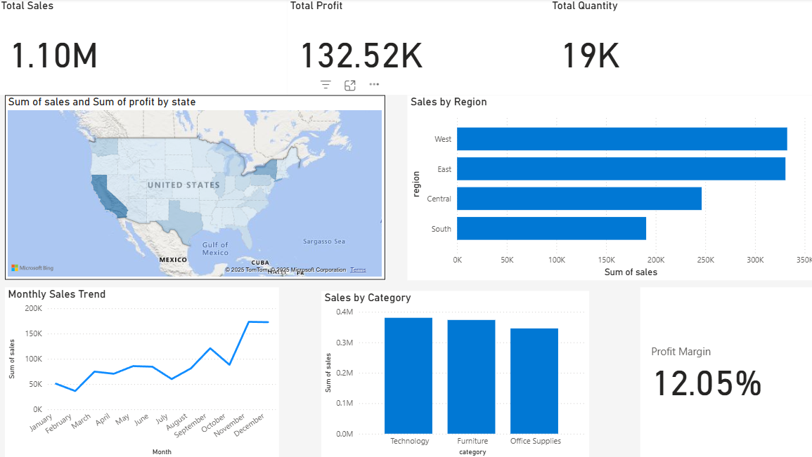

# Superstore Sales Analysis | Excel, SQL, Power BI  

## About the Project  
I worked on the **Superstore dataset** to answer a simple question: *“Where are we making money, and where are we losing it?”*  

To do this, I combined three tools:  
- **SQL** to dig into the raw data and calculate metrics  
- **Excel (Power Query)** to clean and prepare the dataset  
- **Power BI** to turn everything into a clear, interactive dashboard  

The goal wasn’t just to create charts, but to tell a story about the business and give recommendations that make sense in the real world.  

---

## What I Did with SQL  
Before jumping into dashboards, I used SQL to explore the dataset. Some of the questions I asked:  
- What are total sales, total profit, and overall profit margin?  
- Which regions bring in the most revenue, and which lag behind?  
- What are the top-performing states?  
- How do different categories and sub-categories contribute to sales and profit?  
- Do customer segments behave differently?  
- What does sales performance look like month by month?  

 You can find all the queries in the [`queries.sql`](queries.sql) file.  

---

## Key Insights  
Here’s what the analysis revealed:  
- The company generated **$1.10M in sales** with **$132.5K profit** → a **12.05% margin** overall.  
- The **West and East** are strong performers, while **Central and South** regions need attention.  
- **Technology products** drive the most revenue, but **Furniture** and **Office Supplies** drag down profitability.  
- Sales show steady growth through the year with a **big spike in Q4**, confirming strong seasonality.  
- Some states sell a lot but earn little profit — suggesting pricing or operational inefficiencies.  

---

## Dashboard Snapshot  
  

*(Replace `dashboard.png` with your screenshot filename.)*  

---

## My Recommendations  
If this were a real client project, here’s what I’d suggest:  
- Double down on **Central and South regions** with better sales strategies.  
- Fix **Furniture and Office Supplies margins** by rethinking pricing or suppliers.  
- Prepare for **Q4 peaks** with smarter inventory and marketing campaigns.  
- Use **customer segmentation** to identify and retain high-value customers.  
- Audit **low-profit states** to see if discounts or logistics are eating into margins.  

---

## What You’ll Find Here  
- `dashboard.png` → My Power BI dashboard  
- `Superstore_Sales_Analysis_Report.pdf` → Full written report with findings & recommendations  
- `queries.sql` → The SQL queries I used to explore and summarize the data  

---

## Final Thoughts  
This project reminded me that data analysis isn’t just about numbers or pretty visuals.  
It’s about **asking the right questions, validating with data, and turning findings into a story that a business can act on**.  

That’s the mindset I bring to every project I work on.  
